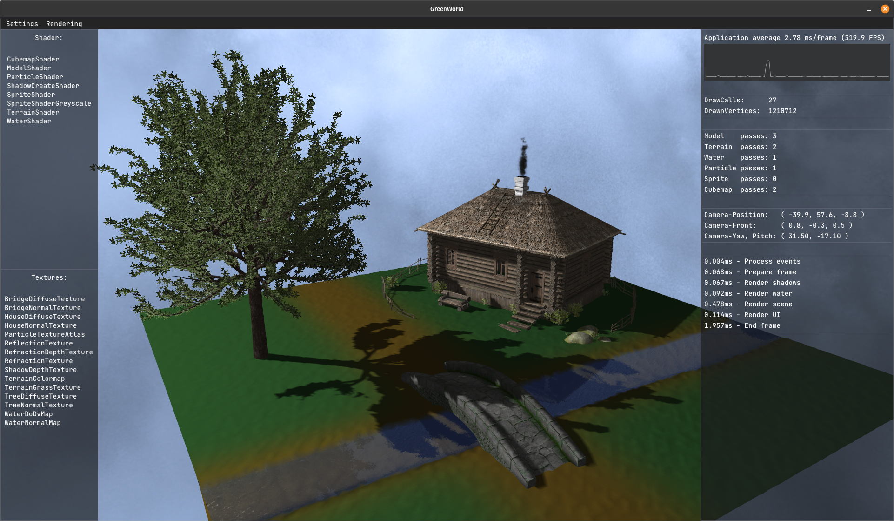
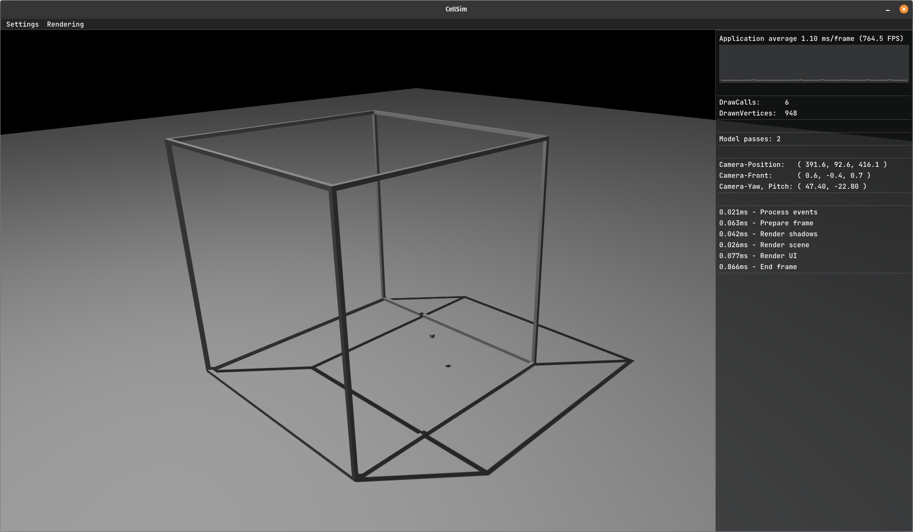

# GameEngine in C++ with OpenGL

## Objectives

- For my personal educational purposes
- Abstraction layer and helper functions for 2D-/3D-Rendering
- Basic OpenGL-Wrapping
- Written in C++17 with OpenGL 4.5
- Example applications that are using the engine
  - GreenWorld: Demo 3D nature scene (finished) ✅
  - CellSim: Cellular automata with 3D cubes (in development) ⌛

## Functionalities

- Basic OpenGL-Wrapping (VAO, VBO, IBO, FBO, Errorhandling)
- Windowcreation
- Resourcemanagement (Shader, Textures)
- File-Management
- Profiling
- UI
- Audio
- Rendering
  - 2D-Sprite-Rendering
  - 3D-Model-Rendering
    - Loading of OBJ-Models
    - Dynamic mesh creation (planes, terrains)
- Camerasystem + Inputmanagement
- Cubemaps/Skyboxes
- Lighting
  - Blinn-Phong
  - Shadow-Rendering
  - Normalmapping
- Water-Rendering
- Instanced-Rendering
  - Particles
    - Smoke

## Plans for future releases

### Graphical improvements

- Bloom
- Lensflare
- Raytracing
  - Shadows and lighting in 2D

### Other

- Grass simulation
- Simulation of liquids

## Libraries (credits to the creators and contributors)

| **Library**                                                          | **Version** | **Commit** | **Updated in Engine** | **Functionality**           |
|--------------------------------------------------------------------- |-------------|------------|-----------------------|-----------------------------|
| [imgui](https://github.com/ocornut/imgui)                            | 1.89.9      | c6e0284    | 20.09.2023            | GUI                         |
| [miniaudio](https://github.com/mackron/miniaudio)                    | 0.11.18     | 3898fff    | 20.09.2023            | Audio                       |
| [stb_image](https://github.com/nothings/stb/blob/master/stb_image.h) | 2.28        | 3ecc60f    | 20.09.2023            | Image loading               |
| [tinyobjloader](https://github.com/tinyobjloader/tinyobjloader)      | /           | 853f059    | 20.09.2023            | Obj file loading            |
| [GLFW](https://github.com/glfw/glfw)                                 | 3.3.6       | 7d5a16c    | 13.01.2022            | Window and input management |
| [glad](https://github.com/Dav1dde/glad)                              | 0.1.34      | a5ca31c    | 11.08.2021            | OpenGL loader               |
| [GLM](https://github.com/g-truc/glm)                                 | 0.9.9.8     | bf71a83    | 23.07.2021            | Mathematics                 |
| [Easylogging++](https://github.com/amrayn/easyloggingpp)             | 9.96.7      | 5181b40    | 19.07.2021            | Logging                     |

## Using & compiling (currently for linux with CMake)

- Tested with Ubuntu 16.04 - 22.04
- Install the external dependencies if needed

      sudo apt install cmake pkg-config
      sudo apt install libglu1-mesa-dev mesa-common-dev
- Clone or download the repository and build it

      git clone https://github.com/Zang3th/GameEngine
      mkdir Build
      cd Build
      cmake ..
      make

## License

- This code is provided under the MIT License. See the file LICENSE for details.

## Applications

### Greenworld

### CellSim

