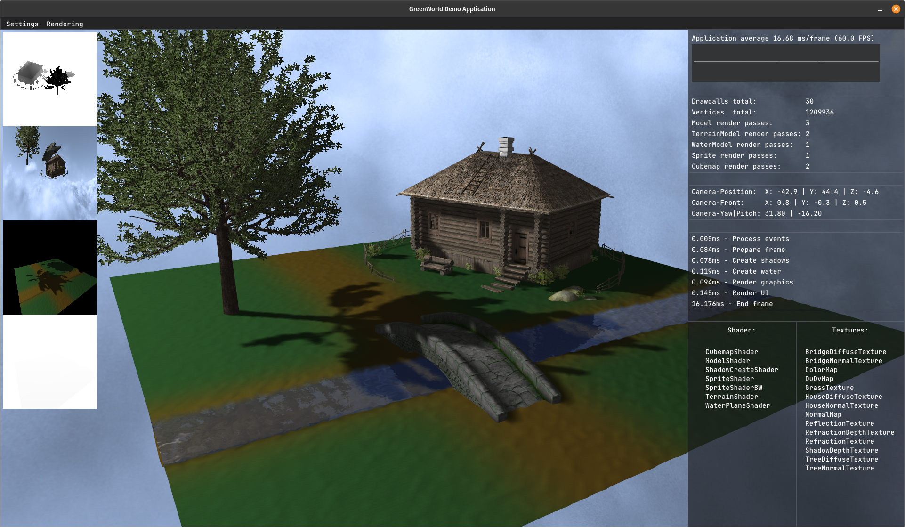

# GameEngine in C++ with OpenGL

### Objectives:
   - Abstraction layer for 2D/3D-Rendering
   - OpenGL-Wrapper-Functions
   - Written in C++17 with OpenGL 4.5
   - Example applications that are using the engine
     - GreenWorld: Demo Nature-Scene (3D)   

### General functionalities
   - Basic OpenGL-Wrapping (VAO, VBO, IBO, FBO, Errorhandling)
     - Windowcreation
     - Resourcemanagement (Shader, Textures)
     - 2D-Sprite-Rendering
     - 3D-Model-Rendering
     - Camerasystem + Control
     - Cubemaps/Skyboxes
   - File-Management
   - Profiling
   - UI
   - Audio
   - Loading of OBJ-Models
   - Creation of basic meshes

### Added functionalities
   - Lighting
     - Blinn-Phong
     - Shadow-Rendering
     - Normalmapping
   - Water-Rendering

### ToDo's
   - Instanced-Rendering
     - Particles
       - Smoke (in process)
     - Grass
   - Bloom
   - Lensflare
   - And a lot more ...

### Credits
   - [glad](https://github.com/Dav1dde/glad)
   - [glfw](https://github.com/glfw/glfw)
   - [easylogging++](https://github.com/amrayn/easyloggingpp)
   - [glm](https://github.com/g-truc/glm)   
   - [stb_image](https://github.com/nothings/stb/blob/master/stb_image.h)   
   - [imgui](https://github.com/ocornut/imgui), [imgui::plot_var](https://github.com/ocornut/imgui/wiki/plot_var_example)
   - [irrKlang](https://www.ambiera.com/irrklang/)
   - [tinyobjloader](https://github.com/tinyobjloader/tinyobjloader)

### Using & Compiling
   - Currently, only for linux with CMake
      - Clone the repository
      - Install the external dependencies if needed
                     
            sudo apt-get update
            sudo apt-get install cmake pkg-config
            sudo apt-get install libglu1-mesa-dev mesa-common-dev  
     
      - mkdir Build
      - cd Build
      - cmake ..
      - make
            
### License:
   - This code is provided under the MIT License. See the file LICENSE for details.

### Current look of the GreenWorld App:
