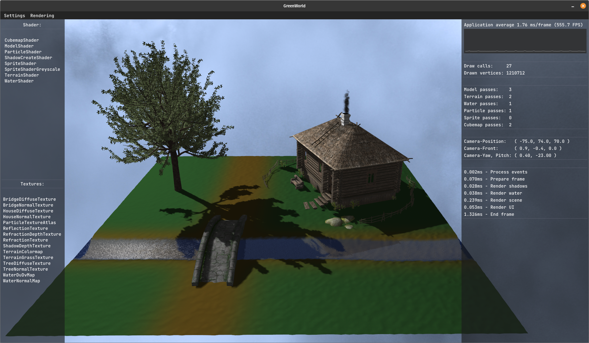
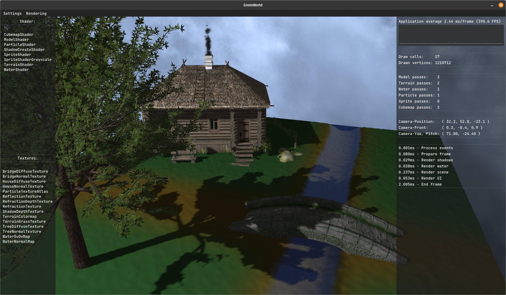
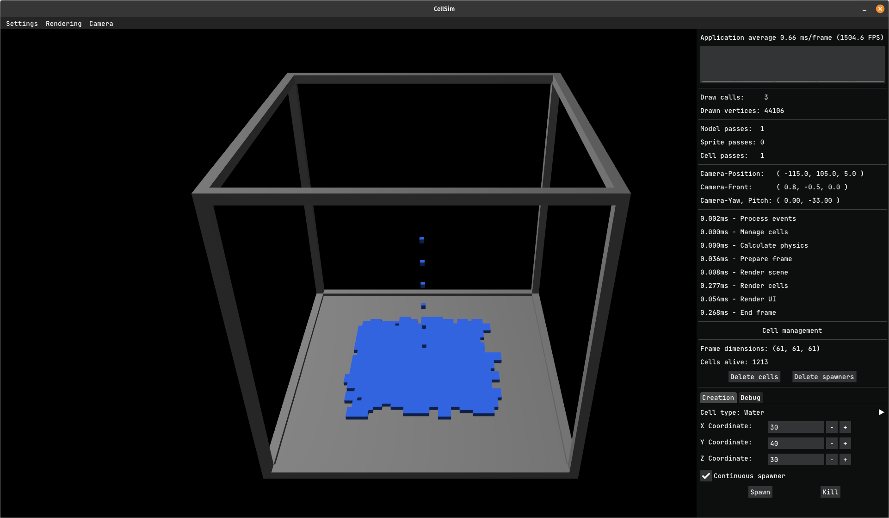
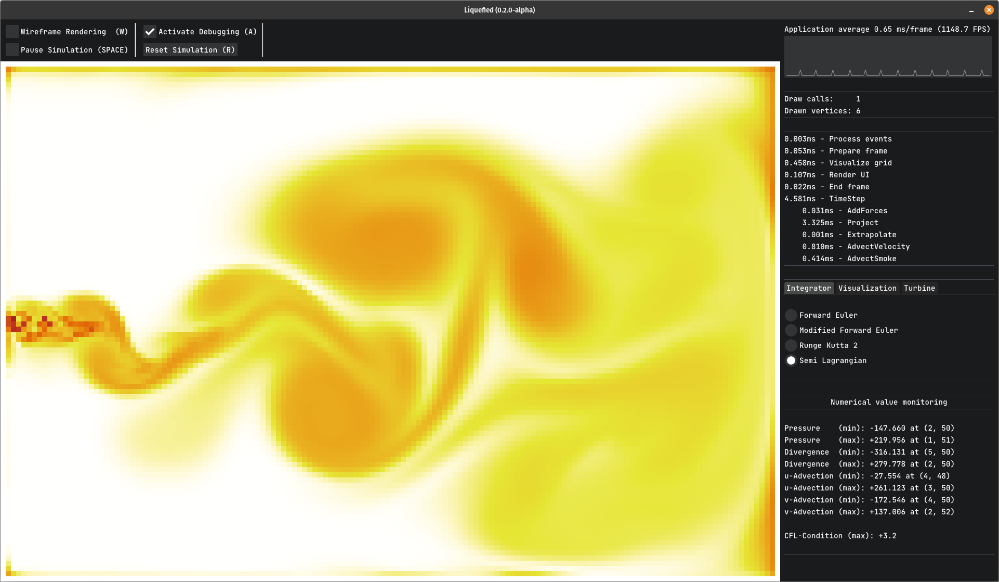
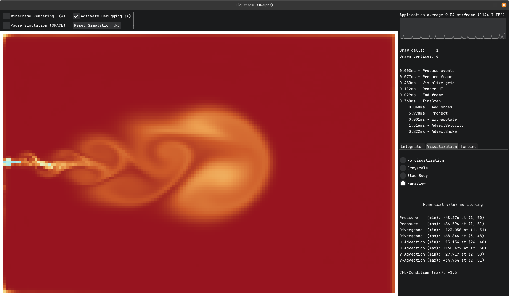

# SalinityGL

## Introduction

SalinityGL is an OpenGL baselayer library for creating (2D/3D) visualization applications. The goal is to create a library that is easy to use and lightweight. SalinityGL provides a thin OpenGL abstraction layer and some basic helper functions to support the process of building rendering applications.

SalinityGL is written in C++17 with OpenGL 4.5. Currently, only Linux is supported. To get started, take a look at the [building and compiling](https://github.com/Zang3th/GameEngine/tree/master#building-and-compiling) section.

During development, several [demo applications](https://github.com/Zang3th/GameEngine/tree/master#demo-applications) were created to test the engine's capabilities. These apps are built and compiled separately from the engine core, but a global parameter file is maintained for the configuration of some *app-to-engine* settings.

The development of this library also serves my educational purposes.

SalinityGL is licensed under the [MIT LICENSE](https://github.com/Zang3th/GameEngine/blob/master/LICENSE).

## Project structure

    SalinityGL/
    ├── Apps/                       # Demo applications
    │   ├── GreenWorld/             # 3D nature scene
    │   └── CellSim/                # 3D Cellular Automata System (on hold) ⌛
    │   └── Liquefied/              # 2D Eulerian Fluid Simulation (in development) 🔥
    ├── Engine/
    │   ├── Application/            # Application and interface stuff
    │   ├── Core/                   # Utilities and core engine functionalities
    │   ├── Debug/                  # Logging and error handling
        ├── Phyics/                 # Code for cellular automata and fluid simulation
    │   ├── Rendering/              # GL stuff, buffers, renderer ...
    │   └── Engine.hpp              # Main header for include in the applications
    ├── Res/                        # Assets, sounds and screenshots
    └── Vendor/                     # Third party libraries

## Base layer functionalities

- Thin OpenGL-Wrapping
  - VAO, VBO, IBO, FBO
  - Resource management (shaders, textures)
  - Error handling
- Window creation
  - UI
- Camera + input management
- Rendering
  - 2D-Sprite-Rendering
  - 3D-Model-Rendering
    - Loading of OBJ-Models
    - Dynamic mesh creation (planes, terrains)
    - Cubemaps/Skyboxes
  - Pixel-Rendering
  - Lighting
    - Blinn-Phong
    - Shadow rendering
    - Normal mapping
  - Water rendering
  - Instanced rendering
    - Flexible 2D particle system
      - Smoke
    - Cellular Automata System (very primitive)
    - Grid-Rendering
- File management
- Profiling
- Audio

## Demo applications

### GreenWorld

Nature scene with water rendering, normal mapped objects, and a particle system to display smoke.

### CellSim (on hold) ⌛

3D Cellular Automata System (experimental - very primitive). Serves as a test and benchmark application for now.

### Liquefied (in development)

2D Eulerian Fluid Simulation on the CPU.

## Building and compiling

The engine and the demo applications are compiled separately. The engine is compiled into a static library and then included in the demo applications' binary. All external libraries ([Vendor/](https://github.com/Zang3th/GameEngine/tree/master/Vendor)) are getting directly included (via source) into the engine and need no separate install. The only exception is GLFW, which gets linked dynamically (.so file is provided).

### What you need

- Linux
  - Tested with Ubuntu 16.04 - 22.04
- C++17 compiler
  - Tested Clang and GCC
- CMake 3.20 or newer
- OpenGL 4.5 compatible graphics card and driver

### How to get started

- Install the external dependencies (if needed)

      apt-get install cmake pkg-config
      apt-get install libglu1-mesa-dev mesa-common-dev

- Clone/download the repository or a particular release

      git clone https://github.com/Zang3th/SalinityGL

- Debug configuration

      mkdir Build_Debug
      cd Build_Debug
      cmake .. -D CMAKE_BUILD_TYPE=Debug -D CMAKE_CXX_FLAGS="-g"
      make -j

- Release configuration

      mkdir Build_Release
      cd Build_Release
      cmake .. -D CMAKE_BUILD_TYPE=Release -D CMAKE_CXX_FLAGS="-O3 -Wno-unused-but-set-variable -Wno-unused-result"
      make -j

- Run the demo applications

## Releases

| **Version**                                                        | **Date**   | **Commit [Count / ID]** | **Lines of code [Apps / Engine]** | **Notes**                               |
|--------------------------------------------------------------------|------------|-------------------------|-----------------------------------|-----------------------------------------|
| [0.1.1](https://github.com/Zang3th/GameEngine/releases/tag/v0.1.1) | 14.01.2023 | [255 / d425a33]         | [480 / 4250]                      | Completion of the *GreenWorld* demo app |
| [0.1.0](https://github.com/Zang3th/GameEngine/releases/tag/v0.1.0) | 11.06.2022 | [229 / 218a55e]         | [575 / 4110]                      | First official release                  |

- 07/2021 - 09/2021: Rewrite of the engine core
- 01/2020 - 09/2020: Some very early projects (still under Windows)

## Roadmap

I always work *on and off* on this project, but I try to make more regular releases until the end of 2024.

### Release preview

- v0.2.0: Completion of the base foundation of the *Liquefied* app
- v0.2.1: Multithreading and visual improvements to the *Liquefied* app
- v0.2.2: Compute Shader implementation of the *Liquefied* app

### Backlog

- 3D fluid simulation
- Some kind of raytracing project

## External libraries

**Thanks to all the creators and contributors of these projects!**

| **Library**                                                          | **Version** | **Commit** | **Updated in Engine** | **Functionality**           |
|--------------------------------------------------------------------- |-------------|------------|-----------------------|-----------------------------|
| [GLFW](https://github.com/glfw/glfw)                                 | 3.4.0       | 7b6aead    | 13.04.2024            | Window and input management |
| [glad](https://github.com/Dav1dde/glad)                              | 2.0.6       | 658f48e    | 13.04.2024            | OpenGL function loading     |
| [imgui](https://github.com/ocornut/imgui)                            | 1.90.4      | 277ae93    | 13.04.2024            | GUI                         |
| [GLM](https://github.com/g-truc/glm)                                 | 1.0.1       | 0af55cc    | 13.04.2024            | Mathematics                 |
| [miniaudio](https://github.com/mackron/miniaudio)                    | 0.11.18     | 3898fff    | 20.09.2023            | Audio                       |
| [stb_image](https://github.com/nothings/stb/blob/master/stb_image.h) | 2.28        | 3ecc60f    | 20.09.2023            | Image loading               |
| [tinyobjloader](https://github.com/tinyobjloader/tinyobjloader)      | /           | 853f059    | 20.09.2023            | Wavefront obj loading       |
| [Easylogging++](https://github.com/amrayn/easyloggingpp)             | 9.96.7      | 5181b40    | 19.07.2021            | Logging                     |

## Credits

This project uses [PVS-Studio](https://pvs-studio.com/pvs-studio/?utm_source=website&utm_medium=github&utm_campaign=open_source), a static analyzer for C, C++, C#, and Java code that's free to use for open source projects and students.
