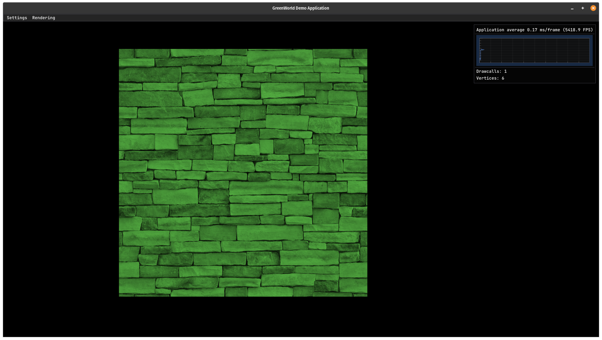

# GameEngine in C++ with OpenGL

## I'm currently rewriting the whole engine. Everything before commit 67cf366 was deleted!

### Objectives:
   - Simple OpenGL-Wrapper functions
      - Located in the engine-core
   - Example applications that use the wrapper functions
   - Written in C++17 with OpenGL 4.5

### General functionalities
   - Currently none
   
### Example applications  
   - Currently none

### Credits
   - [Easylogging++](https://github.com/amrayn/easyloggingpp)
   - [stb_image](https://github.com/nothings/stb/blob/master/stb_image.h)
   - [glad](https://github.com/Dav1dde/glad)
   - [GLFW](https://github.com/glfw/glfw)
   - [glm](https://github.com/g-truc/glm)
   - [imgui](https://github.com/ocornut/imgui)
   - [imgui::plot_var](https://github.com/ocornut/imgui/wiki/plot_var_example)

### Using & Compiling
   - Currently only for linux, using CMake as a buildsystem
      - Clone the repository
      - Install the extern dependencies (glm, GLFW) 
         - Take a look at the credits to find the repositories
      - mkdir build
      - cd build/
      - cmake ..
      - make            
   - Not recommended but there is an old version of the engine (everything before commit 67cf366) that builds on windows
      - Clone the repository and execute the .sln file
            
### License:
   - This code is provided under a BSD-style license. See the file LICENSE for details.

### Screenshots out of applications that I created with the old engine:

#### 3D-World with lighting, models and single raycasting to raise/sink tiles

  
 
#### 3D-Simulation-Project with bullet3 as a physics engine  

#### My implementation of the game "Breakout" from "learnopengl.com":

### Look of the GreenWorld App:
   